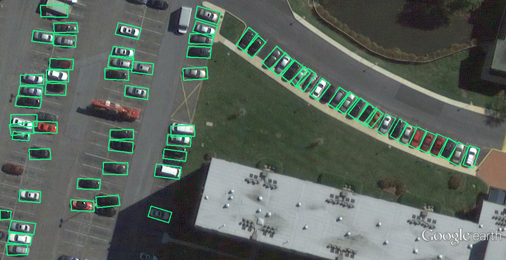
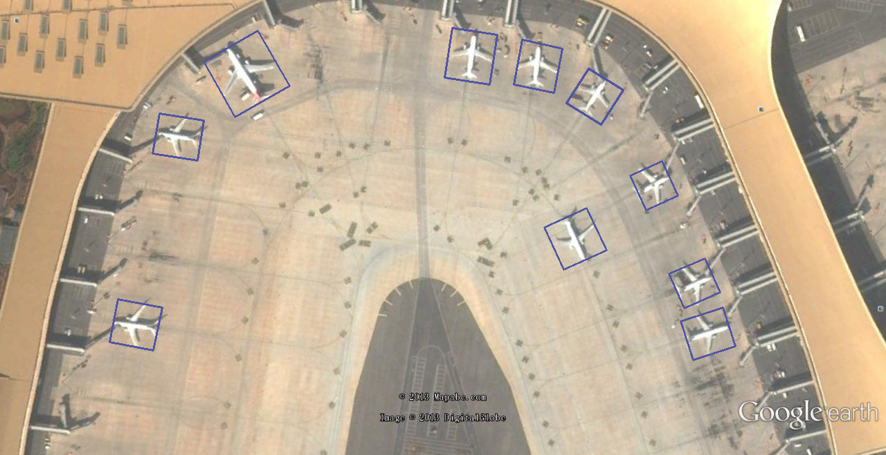

# Yolov3-Polygon

This is a implementation of rotation object detecion based on [YOLOv3-quadrangle](https://github.com/JKBox/YOLOv3-quadrangle). I upgraded it to support pytorch 1.1 or higher and fix some bugs. Object detection in arbitrary orientations is achieved by detecting four corner points, the model has been tested on remote sensing dataset UCAS-AOD and the results can be found [here](https://github.com/ming71/UCAS-AOD-benchmark).

### training

#### dataset

The annotations of your own dataset need to be converted into DOTA format. 

#### imagesets

Generate imageset file via  `utils/generate_imageset.py`

#### config

Modify two parts in `cfg/yolov3.cfg` : 1. classes  2. conv filter before yolo layer should be `(8+cls+1)*3`

Modify training sets in `.data` file. 

Modify classnames in `data/*.names`

### eval

prepare labels:

```
python datasets/UCAS_AOD/ucas_aod2gt.py
```

conduct evaluation:

```
python eval.py
```

### detect

```
python detect.py
```

### Detections





### Thanks to

[YOLOv3-quadrangle](https://github.com/JKBox/YOLOv3-quadrangle)

[mAP calculation](https://github.com/Cartucho/mAP)

[ultralytics yolov3](https://github.com/ultralytics/yolov3)